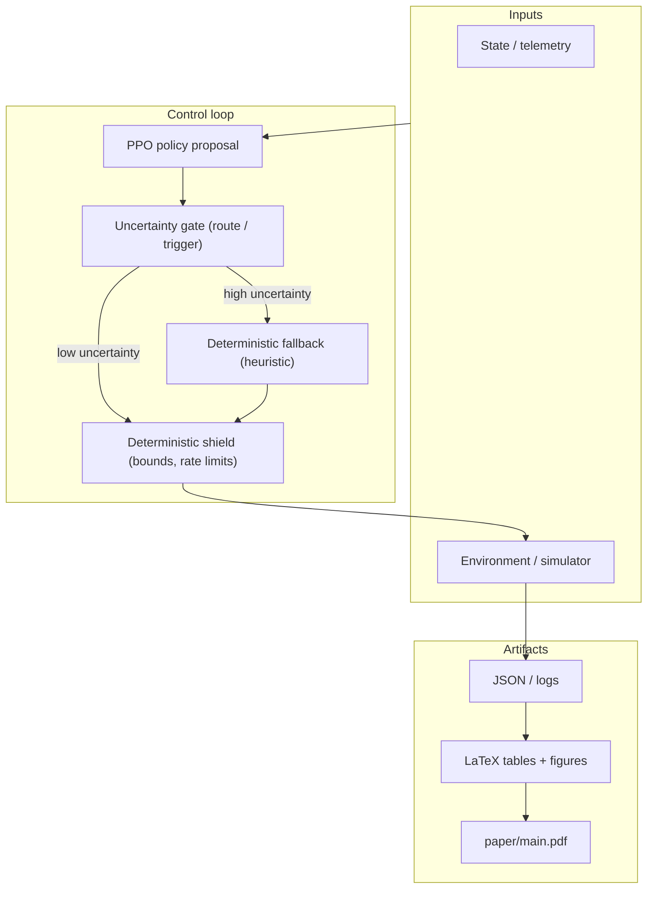

<div align="center">

# QAI-Chain

**Uncertainty-gated safe RL control under shift, with deterministic shielding and reproducible paper artifacts.**

[](https://github.com/IcySpicy21/QAI-Chain)
[](https://github.com/IcySpicy21/QAI-Chain/stargazers)
[](https://www.python.org/)
[](paper/main.pdf)
[](LICENSE)
[](LICENSE-PAPER)

</div>

---

## Problem

Safe RL controllers often fail under **regime shift** in ways that mean-return hides: actions become brittle when telemetry is noisy, adversarial, or non-stationary. In governance-like control loops, this shows up as “bad-day” behavior (bursts, attack pressure, latency spikes), not a simple drop in average reward.

At the same time, production systems frequently keep **deterministic rules** in the loop (fallbacks, clamps, post-checks). The practical gap is a clean, testable pattern that integrates learning with those safety controls and reports outcomes in a reproducible way.

---

## Solution

QAI-Chain studies a concrete decision-time safety pattern on top of PPO:

- **Uncertainty gate**: decide whether to execute the learned action or route to a deterministic fallback
- **Deterministic shield**: clamp / validate actions against hard constraints before execution
- **Compact (quantum-inspired) uncertainty head**: a low-parameter nonlinear signal used for gating (classically simulated)
- **Reproducibility pipeline**: scripts → artifacts → tables/figures → paper build

The core claim is architectural (systems-and-control), not “quantum advantage” and not universal reward dominance.

---

## Architecture



Detailed notes: [docs/ARCHITECTURE.md](docs/ARCHITECTURE.md)

## Repository Map

- [core](core): blockchain primitives, mempool, miner, wallet, and utilities
- [network](network): node communication and RPC server
- [ai](ai): governance logic, models, training, and environments
- [quantum](quantum): QNN, quantum layers, kernels, and transformer modules
- [crypto](crypto): PQC keypair/sign/verify integration
- [zk](zk): proof-generation and verification adapters
- [experiments](experiments): benchmark/research pipelines and outputs
- [scripts](scripts): automation, reporting, publication, and health checks
- [paper](paper): manuscript sources and publication figures/tables

---

## Demo Command

```bash
python -m venv .venv
source .venv/bin/activate
pip install -r requirements.txt
```

### One-command sanity check

```bash
PYTHONPATH=. .venv/bin/python scripts/healthcheck.py && \
PYTHONPATH=. .venv/bin/python -m pytest -q && \
PYTHONPATH=. .venv/bin/python scripts/benchmark_quick.py
```

### One-command recruiter demo

```bash
make showcase
```

This runs a full quick showcase in one go:

- project healthcheck,
- test suite,
- model quick benchmark,
- blockchain smoke demo (signed tx + mined block),
- and prints key assets to present.

Optional paper build in the same flow:

```bash
PYTHONPATH=. .venv/bin/python scripts/showcase.py --with-paper
```

---

## Results

Where to look for outputs:

- **Paper PDF:** `paper/main.pdf`
- **Paper sources:** `paper/`
- **Bench / research artifacts:** `experiments/` (see `experiments/benchmarks/latest.json` if present)
- **Docs summaries:** `docs/` (benchmark/repro/stat analysis files)

**Paper vs code alignment (important):** the manuscript uses two evaluation tracks. **Safety Gym (30 seeds, CPO / P3O / PPOLag)** comes from vanilla OmniSafe training in [`experiments/run_standard_constrained_transfer.py`](experiments/run_standard_constrained_transfer.py)—no QAI-Chain uncertainty gate or shield on that path; it is an external-validity anchor. **Governance simulators, ablations, and stress suites** run the stacked system (gate, shield, robust PPO branch) via scripts such as [`experiments/run_publication_suite.py`](experiments/run_publication_suite.py) and related runners described in `paper/sections/reproducibility.tex`.

If you are presenting this to a recruiter, the easiest demo is `make showcase` plus opening `paper/main.pdf`.

---

## Why this matters

- **Recruiter signal:** demonstrates end-to-end ownership across research engineering (pipelines, artifacts, tests) and scientific reporting (tables/figures/paper build).
- **Safety practice:** formalizes a deployable pattern—**route by uncertainty, then enforce with a deterministic shield**—that can sit on top of existing policy learners.
- **Reproducibility:** turns “trust me” claims into regeneratable artifacts and a paper build you can reproduce from a clean clone.

---

## Core Validation Commands

```bash
# Health and tests
PYTHONPATH=. .venv/bin/python scripts/healthcheck.py
PYTHONPATH=. .venv/bin/python -m pytest -q

# Reproducibility + quick artifacts
PYTHONPATH=. .venv/bin/python scripts/run_reproducibility_harness.py
PYTHONPATH=. .venv/bin/python scripts/generate_benchmark_report.py
PYTHONPATH=. .venv/bin/python scripts/generate_api_schema_docs.py
```

## Experiment Pipelines

```bash
# Standard Safety Gym constrained baselines (OmniSafe only; feeds paper transfer-status table when regenerated)
PYTHONPATH=. .venv/bin/python experiments/run_standard_constrained_transfer.py --seeds $(seq 0 29)

# Research suite
PYTHONPATH=. .venv/bin/python experiments/run_research_suite.py

# Publication-scale suite
PYTHONPATH=. .venv/bin/python experiments/run_publication_suite.py

# Full camera-ready build (artifacts + paper)
.venv/bin/python scripts/build_camera_ready.py --paper-main main.tex
```

## OmniSafe Baselines (Optional Python 3.11 Environment)

```bash
python3.11 -m venv .venv311
source .venv311/bin/activate
pip install -r requirements.txt
pip install omnisafe --no-deps
pip install gymnasium==0.28.1 safety-gymnasium==0.4.1 --no-deps
pip install pandas==2.0.3 numpy==1.26.4 tensorboard wandb rich typer moviepy seaborn gdown
PYTHONPATH=. python experiments/run_omnisafe_constrained_baselines.py --seeds 3,5,7 --total-steps 3000
```

## Paper and Submission Assets

- Main manuscript: [paper/main.tex](paper/main.tex)
- NeurIPS entry: [paper/main_neurips_style.tex](paper/main_neurips_style.tex)
- ICLR entry: [paper/main_iclr_style.tex](paper/main_iclr_style.tex)
- IEEE entry: [paper/main_ieee_style.tex](paper/main_ieee_style.tex)
- Build instructions: [paper/README.md](paper/README.md)

Submission checklists:

- [docs/NEURIPS_SUBMISSION_CHECKLIST.md](docs/NEURIPS_SUBMISSION_CHECKLIST.md)
- [docs/ICLR_SUBMISSION_CHECKLIST.md](docs/ICLR_SUBMISSION_CHECKLIST.md)
- [docs/IEEE_SUBMISSION_CHECKLIST.md](docs/IEEE_SUBMISSION_CHECKLIST.md)
- [docs/PUBLICATION_CHECKLIST.md](docs/PUBLICATION_CHECKLIST.md)

## Key Artifacts

- Benchmark snapshot: [experiments/benchmarks/latest.json](experiments/benchmarks/latest.json)
- Benchmark report: [docs/BENCHMARK_REPORT.md](docs/BENCHMARK_REPORT.md)
- Research summary: [docs/RESEARCH_RESULTS.md](docs/RESEARCH_RESULTS.md)
- Statistical analysis: [docs/STATISTICAL_ANALYSIS.md](docs/STATISTICAL_ANALYSIS.md)
- Reproducibility report: [docs/REPRODUCIBILITY_HARNESS.md](docs/REPRODUCIBILITY_HARNESS.md)

## Project Status and Known Limitations

Current status: active research prototype with reproducible pipelines and publication tooling.

Known limitations:

- OmniSafe constrained baselines require a separate Python 3.11 environment ([.venv311](.venv311)) due dependency compatibility.
- Some venue-official LaTeX style files (NeurIPS/ICLR) are environment-dependent and may need to be dropped into [paper](paper) for exact final formatting.
- Publication build logs may include LaTeX underfull/overfull box warnings that do not break compilation but may require final typographic polishing.

## Cite This Work

If you use this repository in research, please cite it.

- Citation metadata: [CITATION.cff](CITATION.cff)

BibTeX:

```bibtex
@software{qai_chain_2026,
  title   = {QAI-Chain: Safe RL Governance with Quantum-Inspired Efficiency and Verifiable Blockchain Auditing},
  author  = {Gupta, Shivang and QAI-Chain Contributors},
  year    = {2026},
  url     = {https://github.com/IcySpicy21/QAI-Chain}
}
```

## Contributing

Contributions are welcome. Please read:

- [CONTRIBUTING.md](CONTRIBUTING.md)

Quick flow:

- Open an issue with scope and expected outcome.
- Add tests for behavior changes.
- Run healthcheck and test suite locally before opening a PR.
- Keep artifact-generating changes reproducible and script-backed.

## Release Checklist

Use this checklist before tagging a public release.

- Run environment and test checks:
  - `PYTHONPATH=. .venv/bin/python scripts/healthcheck.py`
  - `PYTHONPATH=. .venv/bin/python -m pytest -q`
  - `.venv/bin/pip check`
- Regenerate benchmark and reproducibility artifacts:
  - `PYTHONPATH=. .venv/bin/python scripts/run_reproducibility_harness.py`
  - `PYTHONPATH=. .venv/bin/python scripts/generate_benchmark_report.py`
  - `PYTHONPATH=. .venv/bin/python scripts/generate_paper_tables.py`
- Rebuild publication bundle:
  - `.venv/bin/python scripts/build_camera_ready.py --paper-main main.tex`
  - `.venv/bin/python scripts/create_venue_bundle.py --venue all`
- Verify docs and metadata:
  - Ensure [LICENSE](LICENSE) exists and matches repository settings.
  - Ensure [README.md](README.md) commands match current scripts.
  - Ensure [paper/main.pdf](paper/main.pdf) reflects latest generated tables and figures.
- Final QA:
  - Check [docs/PUBLICATION_CHECKLIST.md](docs/PUBLICATION_CHECKLIST.md)
  - Check [docs/NEURIPS_SUBMISSION_CHECKLIST.md](docs/NEURIPS_SUBMISSION_CHECKLIST.md)
  - Check [docs/ICLR_SUBMISSION_CHECKLIST.md](docs/ICLR_SUBMISSION_CHECKLIST.md)
  - Check [docs/IEEE_SUBMISSION_CHECKLIST.md](docs/IEEE_SUBMISSION_CHECKLIST.md)

## Deployment Templates

- Deployment guide: [docs/DEPLOYMENT_TEMPLATE.md](docs/DEPLOYMENT_TEMPLATE.md)
- Single-node compose: [deploy/docker-compose.single-node.yml](deploy/docker-compose.single-node.yml)
- Local testnet compose: [deploy/docker-compose.local-testnet.yml](deploy/docker-compose.local-testnet.yml)

## License

- **Code:** MIT — see [`LICENSE`](LICENSE)
- **Paper / manuscript assets:** **All rights reserved** — see [`LICENSE-PAPER`](LICENSE-PAPER)
