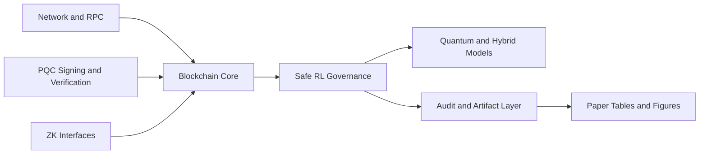

# QAI-Chain

<p align="center">
  <a href="LICENSE"></a>
  <a href=".github/workflows/ci.yml"></a>
  
  
</p>

QAI-Chain is a research-grade modular stack that combines safe reinforcement learning, blockchain governance mechanics, quantum-inspired model components, post-quantum cryptography, and ZK integration hooks.

The repository is designed for reproducible experimentation and publication workflows, from baseline execution to camera-ready paper artifacts.

## Highlights

- Safe control loop with uncertainty-gated routing and deterministic fallback.
- Compact quantum-inspired estimator path for parameter-efficiency experiments.
- Blockchain-native auditable execution path and governance telemetry.
- Reproducibility pipeline: artifacts, reports, figures, and paper builds.
- Venue packaging scripts for NeurIPS, ICLR, and IEEE-style submissions.

## Architecture



Detailed notes: [docs/ARCHITECTURE.md](docs/ARCHITECTURE.md)

## Repository Map

- [core](core): blockchain primitives, mempool, miner, wallet, and utilities
- [network](network): node communication and RPC server
- [ai](ai): governance logic, models, training, and environments
- [quantum](quantum): QNN, quantum layers, kernels, and transformer modules
- [crypto](crypto): PQC keypair/sign/verify integration
- [zk](zk): proof-generation and verification adapters
- [experiments](experiments): benchmark/research pipelines and outputs
- [scripts](scripts): automation, reporting, publication, and health checks
- [paper](paper): manuscript sources and publication figures/tables

## Quick Start

```bash
python -m venv .venv
source .venv/bin/activate
pip install -r requirements.txt
```

## One-Command Final Sanity Check

```bash
PYTHONPATH=. .venv/bin/python scripts/healthcheck.py && \
PYTHONPATH=. .venv/bin/python -m pytest -q && \
PYTHONPATH=. .venv/bin/python scripts/benchmark_quick.py
```

## Core Validation Commands

```bash
# Health and tests
PYTHONPATH=. .venv/bin/python scripts/healthcheck.py
PYTHONPATH=. .venv/bin/python -m pytest -q

# Reproducibility + quick artifacts
PYTHONPATH=. .venv/bin/python scripts/run_reproducibility_harness.py
PYTHONPATH=. .venv/bin/python scripts/generate_benchmark_report.py
PYTHONPATH=. .venv/bin/python scripts/generate_api_schema_docs.py
```

## Experiment Pipelines

```bash
# Research suite
PYTHONPATH=. .venv/bin/python experiments/run_research_suite.py

# Publication-scale suite
PYTHONPATH=. .venv/bin/python experiments/run_publication_suite.py

# Full camera-ready build (artifacts + paper)
.venv/bin/python scripts/build_camera_ready.py --paper-main main.tex
```

## OmniSafe Baselines (Optional Python 3.11 Environment)

```bash
python3.11 -m venv .venv311
source .venv311/bin/activate
pip install -r requirements.txt
pip install omnisafe --no-deps
pip install gymnasium==0.28.1 safety-gymnasium==0.4.1 --no-deps
pip install pandas==2.0.3 numpy==1.26.4 tensorboard wandb rich typer moviepy seaborn gdown
PYTHONPATH=. python experiments/run_omnisafe_constrained_baselines.py --seeds 3,5,7 --total-steps 3000
```

## Paper and Submission Assets

- Main manuscript: [paper/main.tex](paper/main.tex)
- NeurIPS entry: [paper/main_neurips_style.tex](paper/main_neurips_style.tex)
- ICLR entry: [paper/main_iclr_style.tex](paper/main_iclr_style.tex)
- IEEE entry: [paper/main_ieee_style.tex](paper/main_ieee_style.tex)
- Build instructions: [paper/README.md](paper/README.md)

Submission checklists:

- [docs/NEURIPS_SUBMISSION_CHECKLIST.md](docs/NEURIPS_SUBMISSION_CHECKLIST.md)
- [docs/ICLR_SUBMISSION_CHECKLIST.md](docs/ICLR_SUBMISSION_CHECKLIST.md)
- [docs/IEEE_SUBMISSION_CHECKLIST.md](docs/IEEE_SUBMISSION_CHECKLIST.md)
- [docs/PUBLICATION_CHECKLIST.md](docs/PUBLICATION_CHECKLIST.md)

## Key Artifacts

- Benchmark snapshot: [experiments/benchmarks/latest.json](experiments/benchmarks/latest.json)
- Benchmark report: [docs/BENCHMARK_REPORT.md](docs/BENCHMARK_REPORT.md)
- Research summary: [docs/RESEARCH_RESULTS.md](docs/RESEARCH_RESULTS.md)
- Statistical analysis: [docs/STATISTICAL_ANALYSIS.md](docs/STATISTICAL_ANALYSIS.md)
- Reproducibility report: [docs/REPRODUCIBILITY_HARNESS.md](docs/REPRODUCIBILITY_HARNESS.md)

## Project Status and Known Limitations

Current status: active research prototype with reproducible pipelines and publication tooling.

Known limitations:

- OmniSafe constrained baselines require a separate Python 3.11 environment ([.venv311](.venv311)) due dependency compatibility.
- Some venue-official LaTeX style files (NeurIPS/ICLR) are environment-dependent and may need to be dropped into [paper](paper) for exact final formatting.
- Publication build logs may include LaTeX underfull/overfull box warnings that do not break compilation but may require final typographic polishing.

## Cite This Work

If you use this repository in research, please cite it.

- Citation metadata: [CITATION.cff](CITATION.cff)

BibTeX:

```bibtex
@software{qai_chain_2026,
  title   = {QAI-Chain: Safe RL Governance with Quantum-Inspired Efficiency and Verifiable Blockchain Auditing},
  author  = {Gupta, Shivang and QAI-Chain Contributors},
  year    = {2026},
  url     = {https://github.com/maverick0721/QAI-Chain.git}
}
```

## Contributing

Contributions are welcome. Please read:

- [CONTRIBUTING.md](CONTRIBUTING.md)

Quick flow:

- Open an issue with scope and expected outcome.
- Add tests for behavior changes.
- Run healthcheck and test suite locally before opening a PR.
- Keep artifact-generating changes reproducible and script-backed.

## Release Checklist

Use this checklist before tagging a public release.

- Run environment and test checks:
  - `PYTHONPATH=. .venv/bin/python scripts/healthcheck.py`
  - `PYTHONPATH=. .venv/bin/python -m pytest -q`
  - `.venv/bin/pip check`
- Regenerate benchmark and reproducibility artifacts:
  - `PYTHONPATH=. .venv/bin/python scripts/run_reproducibility_harness.py`
  - `PYTHONPATH=. .venv/bin/python scripts/generate_benchmark_report.py`
  - `PYTHONPATH=. .venv/bin/python scripts/generate_paper_tables.py`
- Rebuild publication bundle:
  - `.venv/bin/python scripts/build_camera_ready.py --paper-main main.tex`
  - `.venv/bin/python scripts/create_venue_bundle.py --venue all`
- Verify docs and metadata:
  - Ensure [LICENSE](LICENSE) exists and matches repository settings.
  - Ensure [README.md](README.md) commands match current scripts.
  - Ensure [paper/main.pdf](paper/main.pdf) reflects latest generated tables and figures.
- Final QA:
  - Check [docs/PUBLICATION_CHECKLIST.md](docs/PUBLICATION_CHECKLIST.md)
  - Check [docs/NEURIPS_SUBMISSION_CHECKLIST.md](docs/NEURIPS_SUBMISSION_CHECKLIST.md)
  - Check [docs/ICLR_SUBMISSION_CHECKLIST.md](docs/ICLR_SUBMISSION_CHECKLIST.md)
  - Check [docs/IEEE_SUBMISSION_CHECKLIST.md](docs/IEEE_SUBMISSION_CHECKLIST.md)

## Deployment Templates

- Deployment guide: [docs/DEPLOYMENT_TEMPLATE.md](docs/DEPLOYMENT_TEMPLATE.md)
- Single-node compose: [deploy/docker-compose.single-node.yml](deploy/docker-compose.single-node.yml)
- Local testnet compose: [deploy/docker-compose.local-testnet.yml](deploy/docker-compose.local-testnet.yml)

## License

MIT
