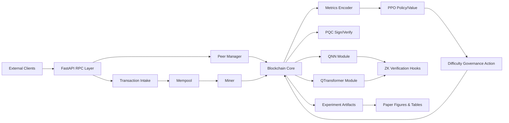
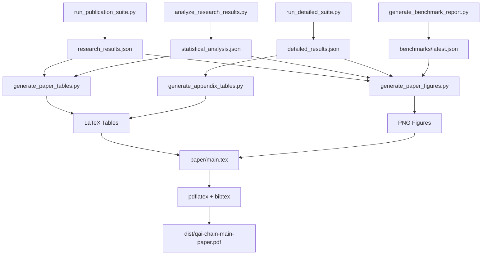
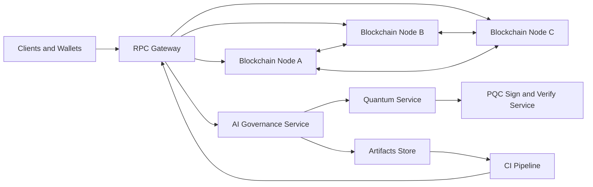

# QAI-Chain Architecture Diagrams (Mermaid)

## System Flow

```mermaid
flowchart LR
    U[External Clients] --> RPC[FastAPI RPC Layer]
    RPC --> PM[Peer Manager]
    RPC --> TX[Transaction Intake]
    TX --> MP[Mempool]
    PM --> BC[Blockchain Core]
    MP --> MINER[Miner]
    MINER --> BC
    BC --> MET[Metrics Encoder]
    MET --> PPO[PPO Policy/Value]
    PPO --> GOV[Difficulty Governance Action]
    GOV --> BC
    BC --> PQC[PQC Sign/Verify]
    BC --> QNN[QNN Module]
    BC --> QT[QTransformer Module]
    QNN --> ZK[ZK Verification Hooks]
    QT --> ZK
    BC --> OBS[Experiment Artifacts]
    OBS --> FIG[Paper Figures & Tables]
```

## Reproducibility Pipeline

```mermaid
flowchart TD
    A[run_publication_suite.py] --> B[research_results.json]
    C[analyze_research_results.py] --> D[statistical_analysis.json]
    E[run_detailed_suite.py] --> F[detailed_results.json]
    G[generate_benchmark_report.py] --> H[benchmarks/latest.json]
    B --> I[generate_paper_tables.py]
    D --> I
    F --> J[generate_appendix_tables.py]
    B --> K[generate_paper_figures.py]
    D --> K
    F --> K
    H --> K
    I --> L[LaTeX Tables]
    J --> L
    K --> M[PNG Figures]
    L --> N[paper/main.tex]
    M --> N
    N --> O[pdflatex + bibtex]
    O --> P[dist/qai-chain-main-paper.pdf]
```

## Deployment Topology

```mermaid
flowchart LR
    C[Clients and Wallets] --> R[RPC Gateway]
    R --> A[Blockchain Node A]
    R --> B[Blockchain Node B]
    R --> D[Blockchain Node C]
    A <--> B
    B <--> D
    D <--> A
    R --> AI[AI Governance Service]
    AI --> Q[Quantum Service]
    Q --> P[PQC Sign and Verify Service]
    AI --> S[Artifacts Store]
    S --> CI[CI Pipeline]
    CI --> R
```
